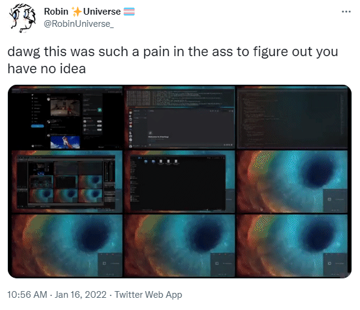

    <h1 align="center">TwitVx ⭐ Extension</h1>

    Adds a <b>Copy TwitVx Link</b> button to Twitter videos!

    

    <a href="https://addons.mozilla.org/en-US/firefox/addon/twitvx-extension/">Get it on Firefox</a> • Get it on Chrome (Coming eventually.)

    This project is licensed under the <a href="https://github.com/robinuniverse/WTFNONPL">WTFNONPL</a>

    edited by <a href="https://github.com/viperr-san">viperr</a> to make it work with <a href="https://github.com/dylanpdx/BetterTwitFix">BetterTwitFix</a>

    all credits for the code go to by <a href="https://github.com/DorukSega">Doruk</a>

